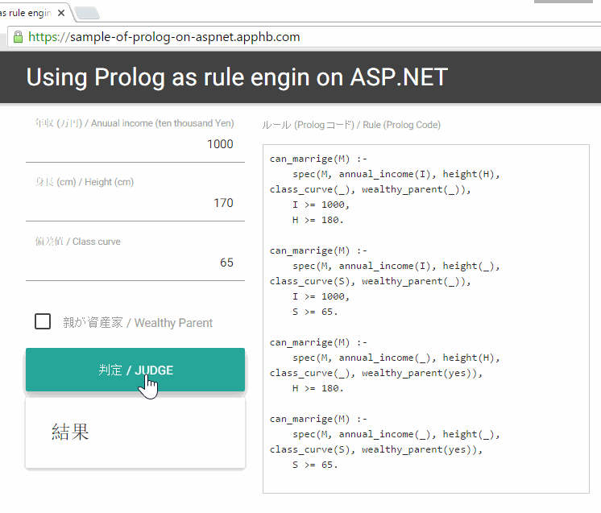

# Sample Code - Using Prolog as rule engin on ASP.NET
# サンプルコード - ASP.NET 上で Prolog をルールエンジンとして使う

 

## Demo / デモ

[https://sample-of-prolog-on-aspnet.apphb.com/](https://sample-of-prolog-on-aspnet.apphb.com/)  

## Powered by...

- CSS styling by [Materialize](http://materializecss.com/)
- [ASP.NET WebAPI](http://www.asp.net/web-api) + C#
- [AngularJS](https://angularjs.org/)
- and, [**C#Prolog**](https://www.nuget.org/packages/CSProlog/), that is Prolog interpreter writen by C#.
